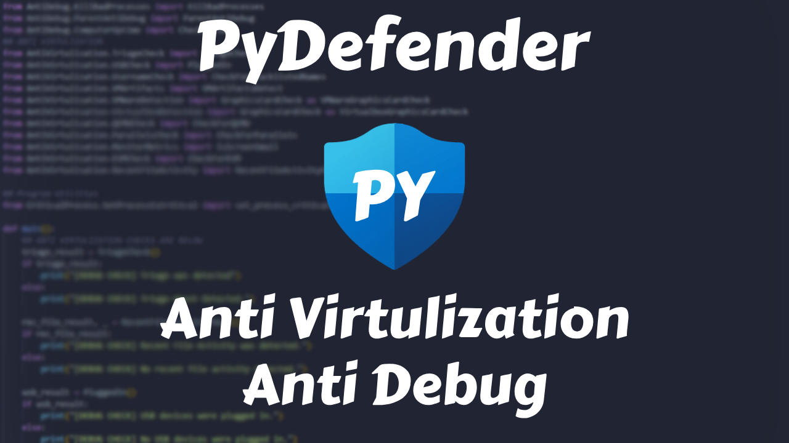

# PyDefender
- This Python code provides functionality to detect and defend against various forms of debugging tools and virtualization environments.

### Anti-Virtualization

- **Triage Detection**: Detects if the system is running in a triage or analysis environment.
- **Monitor Metrics**: Monitors system metrics to identify abnormal behavior indicative of virtualization.
- **VirtualBox Detection**: Detects the presence of Oracle VirtualBox.
- **VMware Detection**: Detects the presence of VMware virtualization software.
- **KVM Check**: Checks for Kernel-based Virtual Machine (KVM) hypervisor.
- **Username Check**: Verifies if the current user is a default virtualization user.
- **Recent User Activity**: Checks user activity; if there are fewer than 20 files, it exits.
- **USB Mount**: Checks if a USB was ever plugged into the computer before.
- **QEMU Detection**: Identifies the presence of QEMU virtualization.
- **Parallels Check**: Detects the use of Parallels virtualization software.
- **VM Artifacts**: Searches for common artifacts indicating a virtual machine environment.

### Anti-Debug

- **IsDebuggerPresent**: Checks if a debugger is currently attached to the process.
- **Remote Debugger**: Detects if a remote debugger is connected to the process.
- **PC Uptime**: Monitors system uptime to detect debugging attempts based on system restarts.
- **Check Blacklisted Windows Names**: Verifies if the process name matches any blacklisted names commonly used by debuggers.
- **Running Processes**: Retrieves a list of running processes and identifies potential malicious ones.
- **Parent Anti-Debug**: Detects if the parent process is attempting to debug the current process.
- **Kill Bad Processes**: Terminates known malicious processes detected on the system.
- **Internet Connection Check**: Checks if an internet connection is present.

### Process
- **Critical Process**: Sets Process as critical

### Quick Nutshell
- PyDefender provides comprehensive anti-virtualization and anti-debugging measures to enhance program security by detecting and countering various forms of virtualization and debugging activities.

## License
This project is licensed under the MIT License. See the LICENSE file for details.